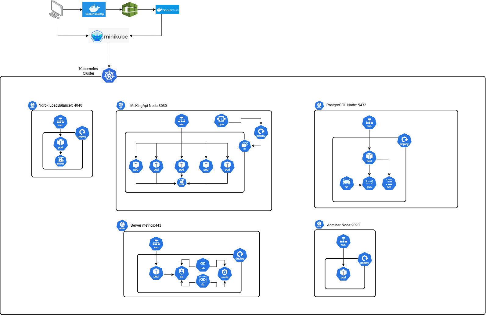
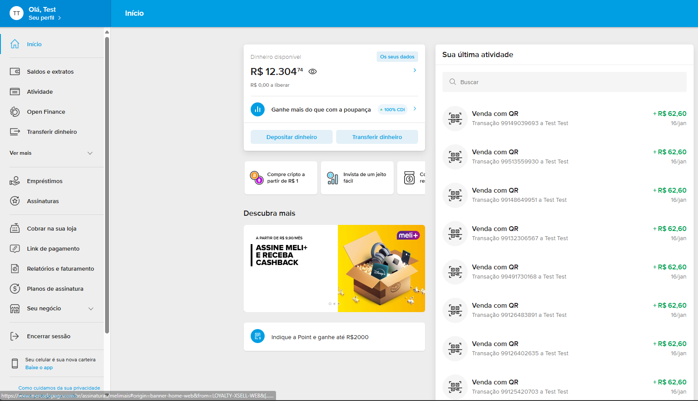
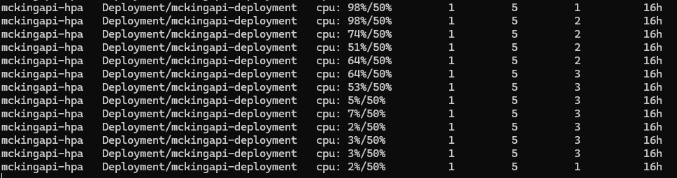

# 9soat-g12-mc-king

Tech Challenge FIAP - 9SOAT - Grupo 12

  

Participantes:

Mayara Manzi - RM359734

 

Renan Eustaquio Claudiano Martins - RM359737

  

Link da documentação Fase 1 e 2:

[https://miro.com/app/board/uXjVLT4i-kY=/](https://miro.com/app/board/uXjVLT4i-kY=/)

  

## Objetivo

Este projeto visa implementar um sistema de autoatendimento para uma lanchonete de bairro que está em expansão devido ao seu grande sucesso. O objetivo é melhorar o atendimento aos clientes e garantir a precisão dos pedidos, minimizando confusões e atrasos.

Melhorar a eficiência do atendimento: Reduzir o tempo de espera dos clientes e garantir a precisão dos pedidos.

Aumentar a satisfação dos clientes: Oferecer uma experiência de atendimento moderna e eficiente.


## Entregáveis da FASE 2


### Refatoração de Código e APIs

Atualização da aplicação desenvolvida na FASE 1 para seguir os padrões **Clean Code**  e **Clean Architecture** 

Implementamos os princípios do SOLID, que são cinco diretrizes para a construção de software de qualidade:

_**S**ingle Responsibility Principle_: Cada classe tem uma única responsabilidade ou motivo para mudar.

_**O**pen/Closed Principle_: As classes devem ser abertas para extensão, mas fechadas para modificação.

_**L**iskov Substitution Principle_: Objetos de uma classe base devem poder ser substituídos por objetos de suas classes derivadas sem alterar o funcionamento do programa.

_**I**nterface Segregation Principle_: Múltiplas interfaces específicas são melhores do que uma interface única e geral.

_**D**ependency Inversion Principle_: Módulos de alto nível não devem depender de módulos de baixo nível. Ambos devem depender de abstrações.

<ins>Novas APIS<ins>: 

**Checkout Pedido** : Receber os produtos solicitados e retornar a identificação do pedido.

**Consultar Status de Pagamento** : Informar se o pagamento foi aprovado ou não.

**Webhook de Pagamento** : Implementar um Webhook para receber a confirmação de pagamento aprovado ou recusado.

**Lista de Pedidos** : Retornar pedidos com suas descrições, ordenados por: Pronto > Em Preparação > Recebido; Pedidos mais antigos primeiro; Pedidos com status Finalizado não devem aparecer na lista.

**Atualizar Status do Pedido** : Garantir que todo o fluxo do pedido seja atualizado para a cozinha iniciar a preparação após o pagamento.

**_Desafio Extra_** : Implementar a integração com Mercado Pago para gerar o QRCode para pagamento e integrar com o Webhook para capturar os pagamentos. Caso contrário, realizar o mock da parte de pagamentos.


### Arquitetura Kubernetes

Criar uma arquitetura em **Kubernetes** que atenda os seguintes requisitos:

**Escalabilidade** com aumento e diminuição de Pods conforme demanda **(HPA)**.

**Arquivos manifestos** (yaml) precisam estar no GitHub junto com a nova versão do código.

Seguir boas práticas de segurança, utilizando **ConfigMap** e **Secrets** para valores sensíveis.

Utilizar **Deployment** e **Service** para expor a aplicação.

  

## Tecnologias Utilizadas

  

Visual studio 2022

.NET - 8.0

Postgres - 16.4

Docker desktop

Docker Hub

Kubernetes

MiniKube

Ngrok

## Desenho da arquitetura




# Guia de Setup do Projeto

  

Este guia descreve o processo de configuração do ambiente para rodar o projeto localmente utilizando Minikube e Docker.

  

## 1. Clonar o Repositório

  

Primeiro, clone o repositório do projeto para sua máquina local e, em seguida, abra um terminal na raiz do projeto.

  

```bash
git  clone  https://github.com/mayaramanziFiap/Tech-Challenge-Fiap-Mc-King-Fase2.git
```

  

## 2. Iniciar o Minikube

  

Com o terminal aberto na raiz do projeto, inicie um cluster Minikube para criar um ambiente Kubernetes local.

  

```bash
minikube  start
```

  

## 3. Configurar o Ambiente Docker com Minikube

  

Configure o Docker para utilizar o ambiente Minikube. Use um dos seguintes comandos:

  

```bash
minikube  docker-env
```

  

Ou, para aplicar diretamente as variáveis de ambiente:

  

```bash
eval $(minikube  docker-env)
```

  

## 4. Construir a Imagem Docker (Opcional)

  

Caso deseje construir a imagem Docker da aplicação, utilize o Dockerfile especificado no diretório `API`:

  

```bash
docker  buildx  build  -t  mckingapi-api:dev  -f  API/Dockerfile  .
```

  

## 5. Navegar para o Diretório e Iniciar o Minikube

  

Navegue até o diretório Kubernetes com o seguinte comando:

  

```bash
cd  Kubernetes
```

  

## 6. Criar o Pod do Banco de Dados

  

Aplique os arquivos de configuração no diretório `database` para criar o pod do banco de dados:

  

```bash
kubectl  apply  -f  Postgres  --validate=false
```

  

## 7. Verificar os Pods

  

Para verificar se os pods foram criados corretamente, execute:

  

```bash
kubectl  get  pod
```

  

## 8. Criar os Pods da Aplicação

  

Aplique os arquivos de configuração no diretório `api` para criar os pods da aplicação:

  

```bash
kubectl  apply  -f  Api
```

  

## 9. Listar os Serviços

  

Para listar todos os serviços que estão rodando no cluster Kubernetes, utilize:

  

```bash
kubectl  get  services
```

  

## 10. Expor o Serviço Externamente

  

Para expor o serviço `mckingapi-service` externamente, execute:

  

```bash
minikube  service  mckingapi-service
```

  

## 11. Criar o Pod do Ngrok

  

Aplique os arquivos de configuração no diretório `Ngrok` para criar os pods do Ngrok:

  

```bash
kubectl  apply  -f  Ngrok
```

## 12. Versão Free do Ngrok

  

A versão free do ngrok precisa de um acesso inicial para habilitar o acessso, copie o link abaixo e clique Acessar:

  

```bash
https://jolly-sure-cardinal.ngrok-free.app/
```
  
## 13. Swagger e Json para testes


Criamos duas collections, sendo uma com o entregavel do modulo 2 e outra com todas as rotas.

```bash
https://github.com/mayaramanziFiap/Tech-Challenge-Fiap-Mc-King-Fase2/tree/main/MCking_collection
```

## 14. Efetuar Pagamento - Mockado e Mercado Pago



## 15. Teste de stress



## 16. Link do Video
Link explicativo


```bash
https://youtu.be/FU4wO9B3adg
```


